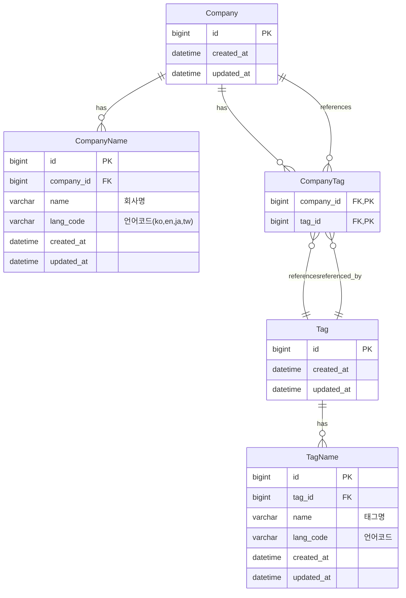

# 🏢 WantedLab 과제용 백엔드 API 서버

원티드랩 시니어 파이썬 개발자 채용 과제 프로젝트입니다.

## ⭐ 핵심 특징

- **🌍 완전한 다국어 지원**: 4개 언어(ko, en, jp, tw) 지원 및 자동 fallback
- **🔍 유연한 검색**: 부분 일치, 태그 기반, 언어 무관 검색
- **⚡ 고성능**: 비동기 FastAPI + SQLAlchemy 2.0 기반
- **🧹 클린 아키텍처**: Repository-Service-API 레이어 분리

---

## 🚀 실행 방법

### Docker 실행 (권장)

```bash
cp .env.example .env
docker-compose up --build
```

### 로컬 실행 (Poetry)

```bash
cp .env.example .env
poetry install
# 데이터베이스 설정 후
poetry run alembic upgrade head
poetry run python dummy/insert_dummy_data.py  # 더미 데이터 삽입
poetry run uvicorn app.main:app --reload
```

### 📦 의존성 설치 (Poetry가 없을 경우)

```bash
# Poetry 없이 실행하려면 아래 명령으로 설치 가능
pip install -r requirements.txt
pip install -r requirements-dev.txt  # 개발 및 테스트 도구 포함
```

---

## 🧪 테스트

```bash
pytest
pytest --cov=app --cov-report=html  # HTML 리포트 생성
```


---

## 🧩 주요 기능

| 엔드포인트 | 메서드 | 설명 | 특징 |
|-----------|--------|------|------|
| `/search` | GET | 회사명 자동완성 | 부분 일치, 다국어 지원 |
| `/companies/{name}` | GET | 회사 정보 검색 | 다국어 지원, 태그 포함 |
| `/companies` | POST | 회사 생성 | 다국어 회사명과 태그 동시 등록 |
| `/tags` | GET | 태그로 회사 검색 | 언어 무관 검색, 중복 제거 |
| `/companies/{name}/tags` | PUT | 태그 추가 | 중복 무시, 다국어 태그 |
| `/companies/{name}/tags/{tag}` | DELETE | 태그 삭제 | 안전한 관계 해제 |

### 🌐 다국어 헤더 지원

모든 API는 `x-wanted-language` 헤더를 통해 응답 언어를 제어할 수 있습니다:

```bash
curl -H "x-wanted-language: en" http://localhost:8000/companies/원티드랩
curl -H "x-wanted-language: ja" http://localhost:8000/tags?query=태그_4
```

---

## 📂 프로젝트 구조 


- **API Layer**: 요청 라우팅 및 의존성 주입 (FastAPI Router)
- **Service Layer**: 도메인 비즈니스 로직 처리
- **Repository Layer**: 데이터베이스 접근 및 ORM 쿼리 수행
- **Model Layer**: SQLAlchemy ORM 엔티티 정의
- **Schema Layer**: Pydantic을 통한 데이터 검증 및 직렬화

```
wantedlab-task/
├── app/
│   ├── api/            # 🚪 FastAPI 라우터 (company, tag, search)
│   ├── core/           # ⚙️ 설정, 언어 처리, 유틸리티
│   ├── db/             # 🗄️ DB 세션 및 트랜잭션 처리
│   ├── models/         # 📊 SQLAlchemy ORM 모델 
│   ├── repositories/   # 🔍 데이터 접근 계층
│   ├── schemas/        # 📋 Pydantic 요청/응답 스키마
│   ├── services/       # 🧠 비즈니스 로직 계층
│   └── main.py         # 🚀 FastAPI 앱 진입점
│
├── tests/              # 🧪 통합 테스트 및 Factory 패턴
├── dummy/              # 📝 초기 더미 데이터 및 삽입 스크립트
├── migrations/         # 🔄 Alembic 마이그레이션 파일
├── pyproject.toml      # 📦 Poetry 기반 프로젝트 설정
├── docker-compose.yaml # 🐳 DB 포함 전체 환경 구성
└── README.md           # 📖 프로젝트 설명서
```

---

## 🛠️ 기술 스택

- **언어 및 런타임**: Python 3.12
- **웹 프레임워크**: FastAPI (완전 비동기 기반)
- **ORM 및 DB**: SQLAlchemy 2.0 (Async), MySQL 8.0, Alembic
- **테스트**: Pytest, httpx, FactoryBoy, pytest-cov
- **코드 품질**: Ruff (Linting), MyPy (Type Checking)
- **패키지 관리**: Poetry
- **컨테이너**: Docker, Docker Compose

---

## 📊 데이터베이스 설계

### 🎯 설계 철학

1. **다국어 지원**: 각 엔티티마다 별도의 다국어 테이블 분리
2. **확장성**: 언어 추가 시 스키마 변경 없이 데이터만 추가
3. **성능**: 적절한 인덱싱 및 외래키 제약 조건
4. **일관성**: CASCADE 삭제를 통한 데이터 무결성 보장

### ERD



### 🔐 주요 제약 조건 및 인덱스

```sql
-- 회사명: 회사별 언어 중복 방지, 언어별 회사명 중복 방지
UNIQUE KEY uq_companyname_lang (company_id, lang_code)
UNIQUE KEY uq_companyname_name_lang (name, lang_code)
FULLTEXT KEY ix_companyname_name_fulltext (name) WITH PARSER ngram

-- 태그명: 태그별 언어 중복 방지
UNIQUE KEY uq_tagname_lang (tag_id, lang_code)
INDEX ix_tagname_name (name)

-- 회사-태그 관계: 중복 관계 방지
PRIMARY KEY pk_company_tag (company_id, tag_id)
```

---

## ⚙️ 환경 설정

### `.env` 파일 예시

```dotenv
# 데이터베이스 설정
DB_HOST=localhost
DB_PORT=3306
DB_NAME=wanted_db
DB_USER=wanted_user
DB_PASSWORD=wanted_password

# 애플리케이션 설정
DEFAULT_LANGUAGE=ko
DEBUG=true
```

### 🐳 Docker 환경

Docker Compose를 사용하면 MySQL과 애플리케이션이 함께 실행됩니다:

```bash
# 전체 환경 실행
docker-compose up 
```

---

## 🌐 API 문서 및 테스트

### 📖 자동 생성 문서

```
http://localhost:8000/docs     # Swagger UI
http://localhost:8000/redoc    # ReDoc
```

### 📄 OpenAPI 스펙

- [API JSON 명세서](./openapi.json)

---

## 🚨 주의사항 및 제약사항

- **Fallback 처리**: 요청 언어가 없으면 다른 언어로 자동 대체
- **중복 처리**: 동일한 회사명이나 태그는 자동으로 무시됨
- **캐스케이드 삭제**: 회사 삭제 시 관련 태그 관계도 함께 삭제
- **MySQL 의존성**: 현재 MySQL FULLTEXT 검색에 의존하므로 다른 DB 엔진 사용 시 수정 필요

---

## 📈 성능 특징

- **비동기 처리**: 모든 DB 작업이 async/await 기반
- **연결 풀링**: SQLAlchemy의 커넥션 풀 활용
- **인덱스 최적화**: 검색 패턴에 최적화된 인덱스 설계
- **지연 로딩**: Relationship의 적절한 로딩 전략 적용


